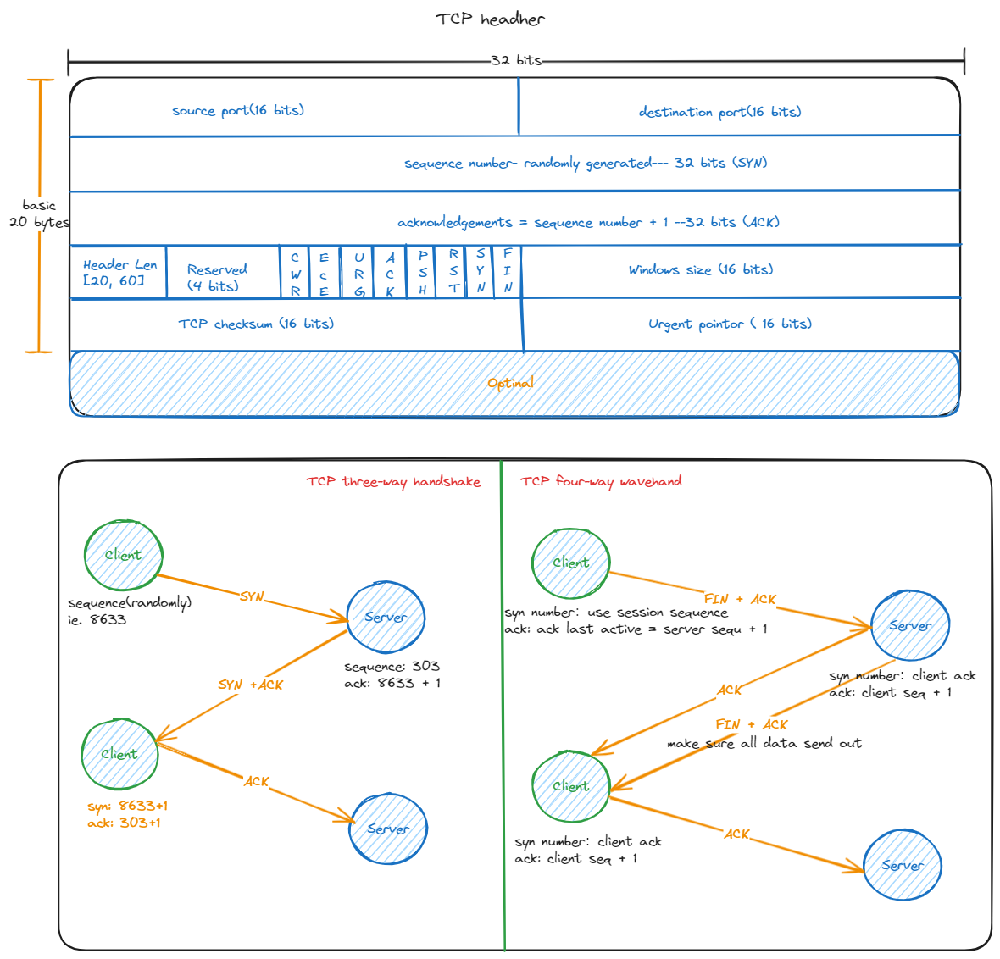

# TCP header structure


# TCP keep-alive and TCP idle time out
TCP keep alive is system settings, it is 7200 seconds(120 minutes) by default. If the appliaction is not specific set the TCP keep-alive time, it will inherit the system default TCP keep-alive time

## Shell command
1. Checking related keep-alive settings
```shell
# check default keep alive. Unit is second. This is the default TCP idle time out
sysctl net.ipv4.tcp_keepalive_time
cat /proc/sys/net/ipv4/tcp_keepalive_time

# Check default keep alive probe. Unit is times
sysctl net.ipv4.tcp_keepalive_probes
cat /proc/sys/net/ipv4/tcp_keepalive_probes

# Check default keep interval. Unit is second
sysctl net.ipv4.tcp_keepalive_intvl
cat /proc/sys/net/ipv4/tcp_keepalive_intvl
```

2. Change related keep-alive settings
```shell
# Note! No space between parameter and equal('=') and No apce between equal('=') and value
sysctl net.ipv4.tcp_keepalive_time=3600
```